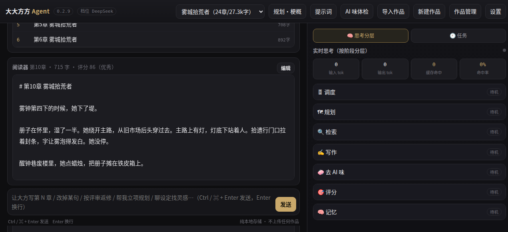
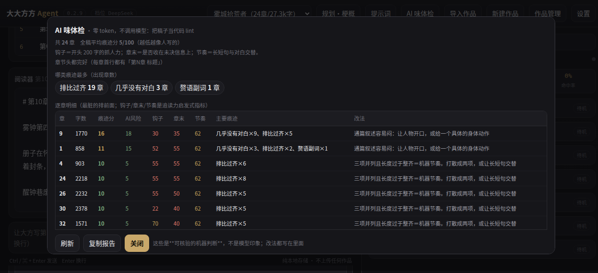

# 大大方方 Agent

**A local LLM writing agent for long-form novels — single Python file, zero third-party dependencies, all data stays on your machine.**

`dafang.py`，一个文件，只用 Python 标准库，作品和数据都留在本机。

它干一件事：帮你写完一部长篇小说。左边是工坊，右边按阶段实时显示它此刻在干什么。


## 截图

| 工作台：左边写稿，右边按阶段实时显示它此刻在干什么 | AI 味体检：零 token 的本地 lint，把稿子当代码查 |
|:---:|:---:|
|  |  |

> 截图里的作品是《雾城拾荒者》。右侧「思考分层」在生成时会逐阶段点亮；「AI 味体检」不调用模型，出的是可核验的机器判断。

## 目录结构

- [截图](#截图)
- [为什么需要它](#为什么需要它)
- [怎么跑](#怎么跑)
- [能做什么](#能做什么)
- [和同类工具的区别](#和同类工具的区别)
- [写一章会发生什么](#写一章会发生什么)
- [几段代码](#几段代码)
- [免责声明](#免责声明)
- [配置](#配置)
- [测试和自检](#测试和自检)
- [目录结构](#目录结构)
- [许可](#许可)

## 为什么需要它

长篇写到三十章以后会开始崩。人物性格飘了，丢掉的物件又冒出来，埋下的伏笔没人收，字数忽长忽短，AI 味越来越重。麻烦的是你往往不知道是哪一步出的问题。

这里把"写一本书"拆成一条看得见的生产线：立项 → 卷级规划 → 逐章写作 → 去 AI 腔 → 多维评分 → 不达标就重做 → 记忆和状态回写。每一步都留痕，哪一步不对能翻出来看。

## 怎么跑

装 Python 3.9 以上，其余什么都不用装。

桌面版（推荐）：解压后双击 `launchers/start-desktop.bat`（Windows），macOS 用 `start-desktop.command`，Linux 用 `start-desktop.sh`。它会开一个没有地址栏的窗口，作品放在「文档/大大方方Agent」。想退出点界面右上的「退出」——关窗口不等于退出服务，这个坑我踩过。

自托管版：`python3 dafang.py`，默认听 `0.0.0.0:11439`，浏览器直接访问。改端口用 `DAFANG_PORT`。

同一份代码，两种形态。

## 能做什么

- 长篇按卷滚动规划，一次只铺前面若干章，写完再铺下一段
- 短篇爆款向和长篇作家向两套写法；小说和散文各有一套评分标尺
- 内置写作者人格「大方」，只写东西，不写代码不建工程
- 对话里改稿：改句、整章替换、追加，能撤销重做；在程序外面手动改过哪章，它也能发现
- 导出 docx / txt / zip，zip 和 txt 还能导回来
- 扩展：`ext/` 里放 skills、prompts、hooks.py、tools.py 就能挂自己的东西

不做的：不写代码，不生成 html / py / json / csv，不画图，不处理数据。

## 和同类工具的区别

| | 常见做法 | 这里 |
|:---|:---|:---|
| 交付 | 装 PyQt / Node / 向量库，或必须挂在 coding agent 上 | 单文件，零第三方依赖 |
| 数据 | 云端，或本地但稿子进向量库 | 全在本机，作品就是 md 和 json |
| 一致性 | 静态角色卡，写"他是什么人" | 事件溯源，写"他现在什么状况" |
| 质检 | 让模型自评 | 本地零 token 体检 + 字数硬指标 + 双模型分歧检测 |
| 成本 | 看不见 | 分层可见：每层 token、缓存命中、单章预算 |
| 出问题 | 靠自己抠日志 | 一键导出诊断包，Key 自动打码 |

具体说几个点。

**主循环是纯 Python 写的。** 读事实、按决策表派发、校验、落盘，都是代码。模型只负责"写"这一件它擅长的事。"下一步干什么""这章要不要打回"由代码判定，所以能穷举测试，行为稳定，也不花 token。

**一致性靠机制，不靠提醒。** 角色状态只追加事件，任意一章的状态由历史推算得出。死了的角色再出场，丢掉的东西又被人用，写完当场就会被点名。每条没回收的伏笔都带着埋设章号，超期会告警。

**篇幅是硬指标。** 只写"约 N 字"，模型会稳定地写到八成五就收尾。所以提示词里给目标区间和"不够怎么补、够了怎么停"，再由程序双向判：不足补足，超标压缩，重做时带着字数红线。

**评分不迷信单个模型。** 评审必须引用原文才能扣分。本地硬指标和模型分并排显示，明显背离就标存疑。配了第二评审时，两边差超过 15 分按保守的那个判。两版分数咬得紧（差 5 分以内）就改用成对比较，直接问哪版更好。绝对分不靠谱是有依据的：LitBench 测下来，最强的零样本 LLM 评审和人类偏好只有七成多一致。

**成本能看见也管得住。** 提示词拼装固定成"稳定前缀 + 易变尾"，实测缓存命中能到八成到九成六。五个阶段可以各配各的供应商。三勾全开只比全关贵一成左右。

**工程上肯下笨功夫。** 71 项回归测试，纯标准库。CI 跑 Ubuntu、Windows、macOS 三套系统，Python 3.9 / 3.11 / 3.12 都验。测试真抓到过东西：滑窗匹配对短字符串永远不成立，丢掉的短物品名因此删不掉。

## 写一章会发生什么

1. 检查这一章有没有被人在程序外改过
2. 规划表里没有就自动补上
3. 查本地知识库，需要就联网，结果入库
4. 组装上下文，发请求写正文（长章可以分节拍写）
5. 清洗：剥掉混进正文的工作内容，章节头由程序重建
6. 去 AI 腔（本地先判，干净就跳过；改坏了回退原稿）
7. 字数体检：超标压一次，不足补一次
8. 一致性检查：拿上一章为止的状态切面找出硬伤
9. 评分：六个维度，要求引用原文
10. 不达标就重做，优先只改评语点名的行，并且只聚焦低分维度
11. 落盘、写指纹、回写记忆与角色状态

发出去的请求分两段。system 里是人设、能力模块、写法地基、评分标尺、篇幅要求，这段逐字节稳定，为的是命中上游的前缀缓存。user 里是本章章蓝图、相关人物地点条目、角色当前状态、伏笔账本、前情摘要、上一版评语，这些每章都在变。

同一本书同样字数，三个开关全关约 3 万 token，全开约 3.3 万，开分节拍写约 4.7 万（缓存命中反而升到六成三）。一致性四件套、AI 味体检、追读力、承诺账本都是零额外调用。这三组是不同章的对照，不是受控实验。

## 几段代码

**章节头由程序写。** 标题只存在正文首行，模型漏写或写岔就永久丢了，界面上会变成无名章。所以任何整章替换、改稿、去味、压缩之后，都从这里重建首行。

```python
def with_head(pid, n, text, title=''):
    if not str(text or '').strip():
        return str(text or '')
    old_t = chap_title(pid, n)
    t_in, body = split_head(pid, n, text)
    ti = (str(title or '').strip() or t_in or old_t or '').strip()
    return '# 第%d%s%s\n\n%s' % (int(n), _unit(pid), (' ' + ti) if ti else '', body.strip('\n'))
```

**篇幅是硬指标。** 目标、可接受区间、做不到怎么办，一次说清。

```python
def word_brief(pid, ratio=0):
    mode, t = word_req(pid)
    if not t:
        return ''
    lo, hi = (t, int(t * WORD_MAX)) if mode == 'min' else (int(t * 0.9), int(t * 1.15))
    head = ('【篇幅·硬指标】本章正文目标 **%d 字**（可接受 %d~%d 字）。' % (t, lo, hi))
    ...
```

**角色状态是事件流的切面。** 每章重写一遍状态快照，越写越飘。改成只追加事件，要哪一章的状态就从头推算到那一章。

```python
def state_at(pid, ch, who=None):
    st = {}
    for e in cev_all(pid):
        if int(e.get('ch') or 0) > int(ch):
            continue
        d = st.setdefault(e['who'], {'物品': [], '状态': '', '位置': '', '关系': [], '已知': [], '死': 0})
        k, op, v = e.get('kind') or '状态', e.get('op') or '~', str(e.get('v') or '').strip()
        if k == '物品':
            if op == '-':
                d['物品'] = [x for x in d['物品'] if not _ovl(x, v, 3)]
            elif v not in d['物品']:
                d['物品'].append(v)
```

**检索用 BM25，中文按字符二元组切。** 不需要分词器，也不需要停用词表，中文的"铜牌"和"牌"这种变化能自己处理。

```python
def _tok(text):
    s = str(text or '').lower()
    out = _LAT.findall(s)
    for run in _CJK.findall(s):
        if len(run) == 1:
            out.append(run)
        else:
            out.extend(run[i:i + 2] for i in range(len(run) - 1))
    return out
```

**上游的错误要说人话，还要分清能不能重试。** 401 是钥匙不对，402 是钱不够，429 还要再分是限流还是当日额度用完。前几种再试也没用，批量写作当场就该停，别拿同一章撞三遍。

```python
class APIError(Exception):
    """fatal=True 表示再试也没用，批量写作应当立刻停。"""
    def __init__(self, msg, st=0, kind='', fatal=False):
        Exception.__init__(self, str(msg)); self.st = int(st or 0)
        self.kind = kind or ''; self.fatal = bool(fatal)

def _classify(st, txt):
    ...
    if st == 401:  return 'auth',  True,  '鉴权失败'
    if st == 402:  return 'quota', True,  '余额/额度不足'
    if st == 404:  return 'model', True,  'Base URL 或模型名不对'
```

**Key 绝不外流。** 上游有时会把你的 Key 回显在错误正文里，诊断包里又带着真实配置，所以脱敏写成代码，不靠自觉。诊断包有对应的泄漏测试：拿真 Key 生成一次，断言包里搜不到。

```python
def _redact(s, key=''):
    t = str(s or ''); k = str(key or '')
    if len(k) >= 8:
        t = t.replace(k, '***')
    return _KEYISH.sub('***', t)
```

## 免责声明

用之前请看完这几条。

生成的文字拿去做什么、发到哪里、合不合平台规则和法律，由你自己判断，责任也在你。各平台对 AI 生成内容的标注要求一直在变，这里不做任何"能过审"的承诺。

AI 生成文本的著作权归属各地认定不同，商业投稿、出版、改编之前请自己评估。这里不内置任何语料、图片、字体，提示词不引用任何作家原文。

代码是我和 AI 编程助手一起写出来的：我提需求、定方案、逐项验收，它写实现。代码里可能还留着 AI 常有的毛病和没覆盖到的边界，关键场景请自己复看。

模型 API 是你自己配的，费用、额度、数据条款都是你和那一方的事。用免费额度或第三方中转要注意日限额、并发限制和条款风险。Key 存在本机 `config.json`（权限 600，已被 .gitignore 排除），但我没法替你保管凭据，请定期轮换。

作品是普通文件，删了就没了。程序有回收站和导出，风险还是你自己担，建议定期拷一份。

软件按 MIT 许可原样提供，不带任何担保。README 里的 token 和性能数字是本机实测的参考值，不是承诺。这是个人项目，单人开发维护，没有客服，有 bug 欢迎提 issue。

## 配置

优先级是手填参数 > 分档配置 > 全局默认。规划、写作、对话、去味、评分五个阶段可以各设 Base URL、模型、Key、温度、输出上限和额外请求头，留空就沿用默认。评分还能再挂一个第二模型，填另一家才算真独立。适配档位留空就按模型名自动识别，厂商锁死温度这类差异会自动处理。

设置面板里能导出诊断日志，出问题时导出发我，里面有分档实际生效的配置、token 汇总、最近几次评审的逐维得分，Key 全部打码。界面打不开就用 `python3 dafang.py --diag`。

改单章字数：「作品管理」里直接改，下一章生效。删作品先移进回收站，能还原。

对话输入框 Enter 换行，Ctrl / ⌘ + Enter 发送。

## 测试和自检

```bash
python3 -m unittest discover -s tests -v    # 71 项，约 0.8 秒，不联网不调模型
python3 dafang.py --selftest                # 环境自检，真起一次服务打一次接口
python3 dafang.py --diag 作品名              # 导出诊断包
python3 uninstall.py --dry-run              # 卸载，默认不动作品目录
```

## 目录

```text
dafang.py                整个程序，内嵌页面
launchers/               双击启动器，Windows / macOS / Linux，另有自检和卸载
tests/test_core.py       71 项回归测试
deploy/dafang.service    systemd 示例
.github/workflows/       CI：测试、桌面版打包
install.sh                Linux 安装脚本
uninstall.py             卸载，默认保留作品目录
```

运行时都在作品目录里（桌面版默认是「文档/大大方方Agent」）：


<details>
<summary>点开看运行时目录结构</summary>

```text
config.json              配置和 Key，0600，不入库
novels/书名/              圣经、人物、地点、伏笔、大纲、章节规划、别名表
                         chapters/第N章.md，连同历史快照和改动台账
                         character_events.jsonl 角色状态的真源，CHARACTER_STATE.md 是派生视图
                         reviews/第N章.json 逐维得分和返修意见
                         log.jsonl token 记录，wiki/ 本地知识库
skills/ ext/             自己装的技能和扩展
_trash/                  回收站
```
</details>

## 许可

MIT，见 `LICENSE`。第三方说明见 `THIRD_PARTY.md`。
